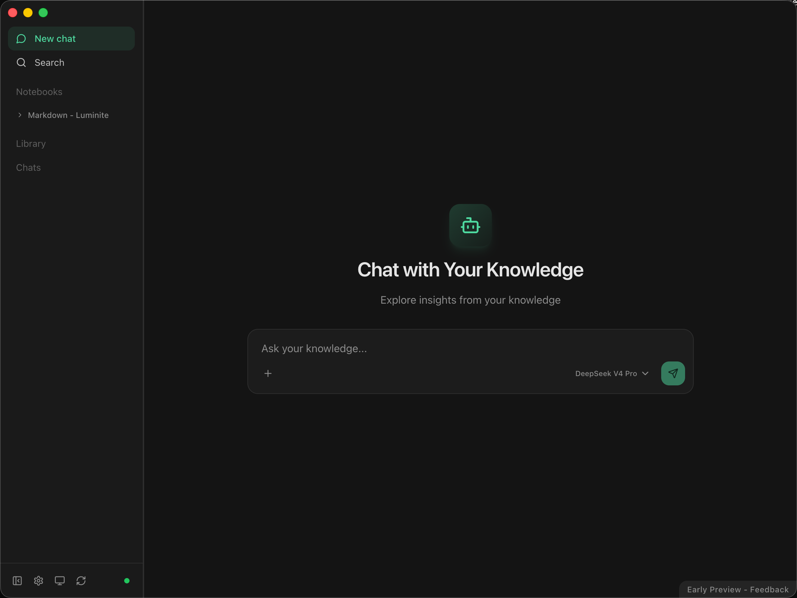
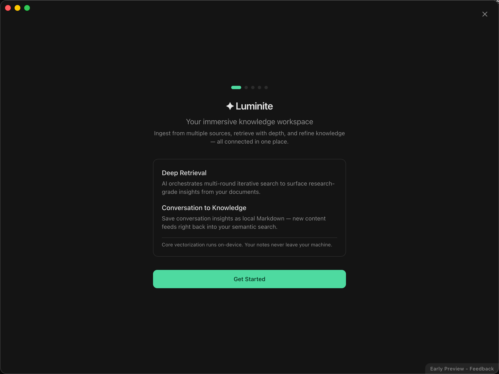

  

  <b>English</b> | <a href="./README_zh.md"><b>简体中文</b></a>

  
  
  
  
  
  

  <a href="#-what-problems-does-it-solve">Problems It Solves</a> •
  <a href="#-core-features">Core Features</a> •
  <a href="#-quick-start">Quick Start</a>

# ✦ Luminite

**AI-Native Immersive Knowledge Workspace**

A closed-loop system that seamlessly connects *multi-source data ingestion*, *intelligent retrieval orchestration*, and *knowledge processing & accumulation*. Build a dedicated digital brain on your local machine — one that responds instantly and thinks deeply.

|  |  |
|:---:|:---:|

---

## 🤔 What Problems Does It Solve?

### 🔀 Information Fragmentation

Knowledge scatters across cloud platforms and local drives. Piecing together a project's full picture forces constant app-switching, severely breaking your flow state.

### 💤 Dormant Local Data

PDFs, Word docs, PPTs, and historical files pile up on your machine. These "dead data" lack an activation mechanism — never surfaced when you actually need them.

### ✂️ Tool Fragmentation

"Reading materials," "querying AI," and "writing new content" live in separate apps. New content can't seamlessly complement your existing knowledge base.

### 🕳️ Shallow Retrieval Limits

Complex questions spanning multiple documents need depth — not surface-level stitching. You need multi-round deep investigation that fills implicit context automatically.

---

## 🚀 Core Features

### 🤖 Agentic RAG — Iterative Retrieval Based on ReAct

> LLM as core orchestrator. Breaks free from single-retrieval pipelines — autonomously selects tools, reads full documents, performs multi-round reasoning with supplementary retrieval. Delivers panoramic, well-substantiated research conclusions.

### 🏠 Local-First — Data Sovereignty Returns to You

> Vectorization, on-device embedding inference, and semantic indexing all run locally. Files reside in plaintext on local storage. Physical-level isolation for sensitive data — zero cloud privacy leakage.

### 📝 Markdown as First-Class Citizen — Zero Lock-in

> All data stored as standard Markdown with Frontmatter metadata. Long-term readability, cross-system portability, no vendor dependency.

### 🔑 Out-of-the-Box & BYOK

> Preset APIs ready to go. Bring Your Own Key supported. Switch between model providers in real time based on task workloads.

### 🌐 Cross-Domain Data Source Aggregation

> Native integration with **Notion, Feishu, Apple Notes**, and 6+ external knowledge domains. Multi-modal high-fidelity parsing (DDU) with silent incremental sync. Breaks down information silos across SaaS platforms.

### 🔄 Knowledge Flow Closed Loop

> One-click persistence of conversation insights into local Markdown docs. Ephemeral interactions → sustainable knowledge production. New content immediately feeds back into your semantic network.

### 🔍 Transparent Reasoning, Auditable Sources

> Real-time streaming of reasoning logic and Function Call chains. Every claim hard-linked to precise source jump links. Strips the AI black box — full verifiability.

### 🔌 MCP (Model Context Protocol) Support

> Expose as a standard MCP Server via HTTP streaming. Extends Luminite from standalone app into a **system-level context module** — external tools can invoke your local knowledge network directly.

### 🧲 Multi-Level Hybrid Retrieval & Implicit Association

> Semantic search + keyword full-text search + hybrid retrieval, combined with entity recognition at ingestion. Discovers non-intuitive associative structures between isolated concepts.

### 💬 Conversation Lifecycle & Multimodal Interaction

> Dynamic branch management, context truncation, node tracing, partial re-rendering. Image attachments and long-text injection. Precise fine-tuning control over the LLM context window.

### ⚙️ Async Scheduling Engine & Eventual Consistency

> FSM-based filesystem debounce engine + multi-stage pipelines + periodic orphan reconciliation. Strong consistency across retrieval indices, local DB, and file layers under high-frequency concurrent R/W.

### 🧩 Targeted Chunking & Interface Degradation

> Customized extraction per data source (e.g., Notion block-level API adaptation). Six-level recursive semantic slicing preserves document context coherence and section topology.

---

## 🚀 Quick Start

### 1. Download & Install

- Visit the [official website](https://luminite.md) to download the latest version for macOS.
- Drag `Luminite.app` into your **Applications** folder.

### 2. Initial Setup

1. Launch Luminite and complete the onboarding guide.
2. Configure your LLM provider (use preset APIs or bring your own key).
3. Connect data sources — local folders, Notion, Feishu, Apple Notes, etc.

### 3. Start Using

- **Ask questions**: Open the conversation panel and query across all your connected knowledge.
- **Ingest documents**: Drop PDFs, Markdown, Word, or PPT files into Luminite — they'll be indexed automatically.
- **Save insights**: One-click persist any conversation insight back into your local knowledge base.

### 4. MCP Integration (Optional)

Enable the built-in MCP Server to let external AI tools (e.g., Claude, Cursor) access your local knowledge network directly.
