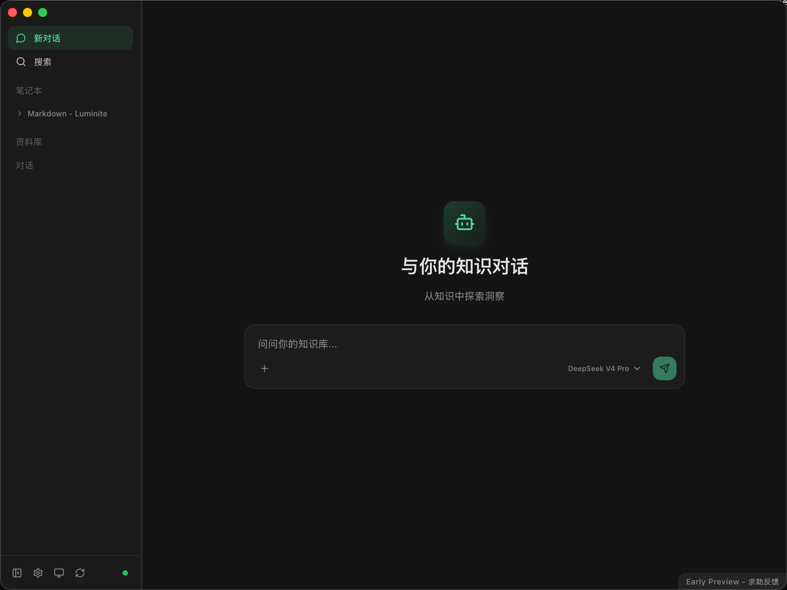
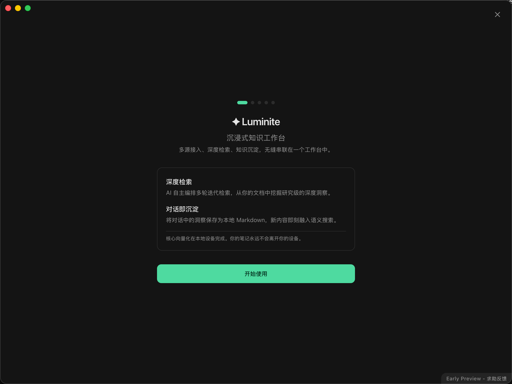

  

  <a href="./README.md"><b>English</b></a> | <b>简体中文</b>

  
  
  
  
  
  

# ✦ Luminite

**AI Native 沉浸式知识工作台**

将*多源数据摄取*、*智能编排检索*、*知识加工与沉淀*无缝串联的闭环系统。在本地为你构建一个随时响应、深度思考的专属数字大脑。

|  |  |
|:---:|:---:|

---

## 🤔 解决什么问题？

### 🔀 信息碎片化的检索耗损

知识散落在云端协作平台与本地硬盘的角落。拼凑项目全貌被迫在多个应用间来回切换与机械搜索，极大打断心流。

### 💤 海量本地资料"沉睡"

PDF、Word、PPT 和历史文档大量囤积，这些"死数据"缺乏激活机制——需要时无法被自动唤醒并纳入思考链路。

### ✂️ 知识生产与消费的工具割裂

"阅读资料"、"向 AI 提问"、"撰写新内容"被迫在不同软件中进行。新内容无法与已有知识库无缝互补与实时沉淀。

### 🕳️ 浅层检索无法满足深挖需求

面对跨多文档、时间维度的复杂问题，基础搜索只能给出表层拼凑。你需要的是自动多轮深挖、主动补全隐性上下文的深度综合洞察。

---

## 🚀 核心特性

### 🤖 Agentic RAG — 基于 ReAct 的迭代检索

> LLM 作为核心调度者，突破单次检索的固定管道——自主选择工具、阅读完整文档、多轮逻辑推演与补充检索。面对复杂查询，跳出局部信息局限，提供全景视野且经得起推敲的研究结论。

### 🏠 Local-First — 数据主权交还用户

> 核心向量化、端侧 Embedding 推理与语义索引均基于本地算力完成。文件以纯文本驻留本地存储，为敏感数据构建物理级隔离，彻底剥离云端隐私外泄风险。

### 📝 一等公民 Markdown — 零平台锁定

> 全量数据统一解析并存储为携带 Frontmatter 元数据的规范 Markdown 文件。确保长期可读性与跨系统可迁移，解除供应商依赖焦虑。

### 🔑 开箱即用 & BYOK

> 预设 API 即装即用，支持自带大模型 Key。算力调配与成本选择权交还用户，支持根据任务负载在不同模型提供商之间实时切换。

### 🌐 跨域数据源聚合

> 原生集成 **Notion、飞书、Apple Notes** 等 6 大外部知识域。多模态高保真解析引擎（DDU）静默执行增量同步与文档向量化，从物理层面打破 SaaS 平台间的信息孤岛。

### 🔄 知识流转闭环

> 一键将对话中的深度洞察持久化为本地 Markdown 文档。临时交互 → 可持续知识生产流。新生成内容即刻反哺本地语义网络，实现知识库持续积累迭代。

### 🔍 思维过程透明，溯源可审计

> 实时透传 LLM 推理逻辑与 Function Call 全景链路。核心实体与观点均硬绑定至精准源跳转链接，剥离 AI 黑盒属性，确保输出真实性与可验证性。

### 🔌 MCP (Model Context Protocol) 支持

> 应用可作为标准 MCP Server 对外暴露，通过 HTTP 流式协议桥接外部系统。从独立桌面应用拓展为**系统级上下文模块**——外部工具可直接调用与读取本地知识网络。

### 🧲 多级混合检索与隐性关联挖掘

> 语义检索 + 关键词全文检索 + 混合检索，结合入库阶段实体识别。在保障极端条件召回率的同时，发现孤立概念间的非直觉关联结构。

### 💬 对话生命周期与多模态交互

> 内置动态分支管理，支持上下文截断、节点溯源与局部重渲染。提供图片附件与长文本注入，赋予用户对 LLM 上下文窗口的精确微调能力。

### ⚙️ 异步调度引擎与最终一致性存储

> 基于 FSM 的文件系统防抖引擎 + 多阶段流水线 + 周期性孤儿数据核对。高频并发读写下，保障检索索引、本地数据库与物理文件的强一致与高可用。

### 🧩 针对性分块策略与接口降级

> 根据异构数据源特性实施定制化降级抽取（如 Notion 块级 API 适配），六级递归语义切片算法。最大程度保留文档上下文连贯度与章节拓扑结构。
